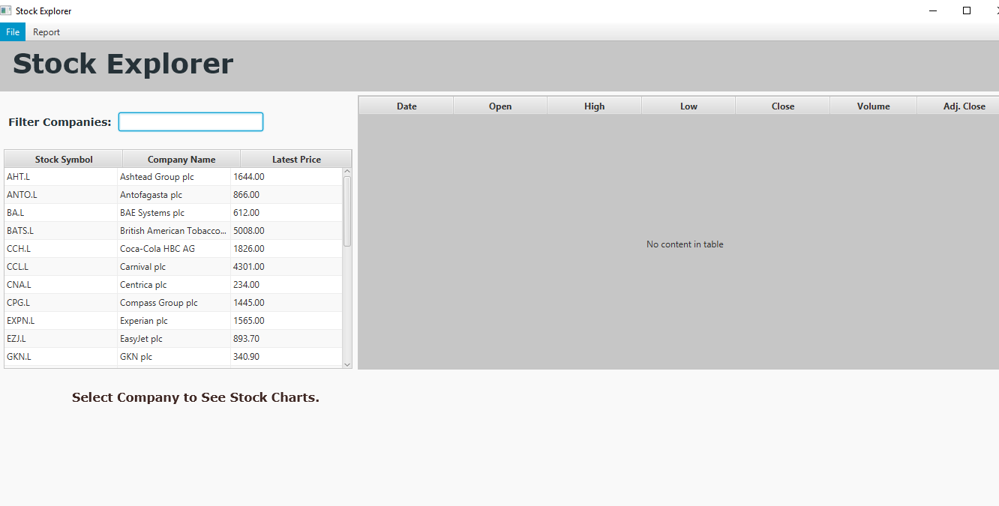
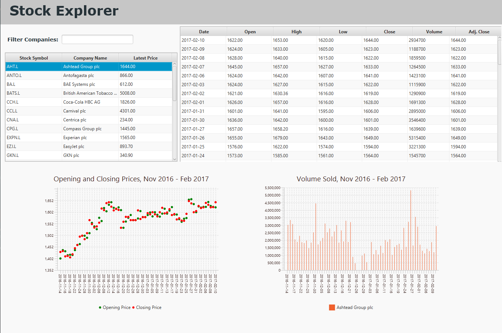
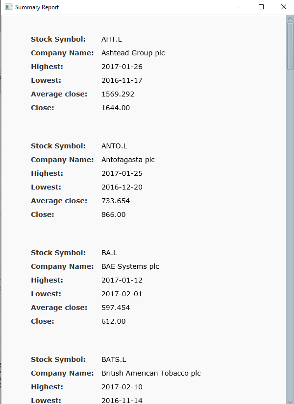

# StockApp
The individual project assignment that involved implementing a Simple Stock Viewer using JavaFX.

## Main Features

#### Use Case 1: 
the application should read the data stored in CSV file and show basic information: stock symbol, company name and latest share price.

This functionality has been mainly implemented in `MainApp`, `Company` and `CompanyOverview` classes. 
I created an `ObservableList` of Companies, with hard-coded symbol, name and CSV file name which would populate the first table created in Scene Builder. To do so, the `initialize()` method in `CompanyOverview` sets data to each column accordingly with the help of `SetCellValueFactory()` method. 
 

#### Use Case 2: 
the user can select an individual company to see a more detailed view. 

The user can click on each row of the first table to populate the second one with all historical data. 
The placeholders for charts are connected as well. The user can see two charts for each company. 
The first one is a Scatter Chart to show opening and closing prices. As a default, the symbols for the first two series are circle and square. I created `Chart.css` to override this behaviour, so both symbols are smaller red/green circles as I believe that colours are more intuitive for a user familiar with stock charts. 
The second chart is a bar chart that shows the volume of sold shares. I decided to make two charts instead of one to make the information more readable.
As an extra feature, I implemented a filtered list so the user can find faster the company he/she is looking for.
  

#### Use case 3: 
generate a report containing key facts of each company and save to text file. 

To meet this requirement, first,  in the `Company` class I extracted all needed information from the CSV file. 
Then in the `RootLayoutController`, I implemented `handleSaveAs()` method which would open the File Chooser window and allow the user to create a new text file. 
After this, the `saveCompaniesDataToFile()` method from `MainApp` would be called to save the needed data.

As an extra feature, the user can  see the summarized report in the new window after clicking on Show Report item in Report Menu. 

 

